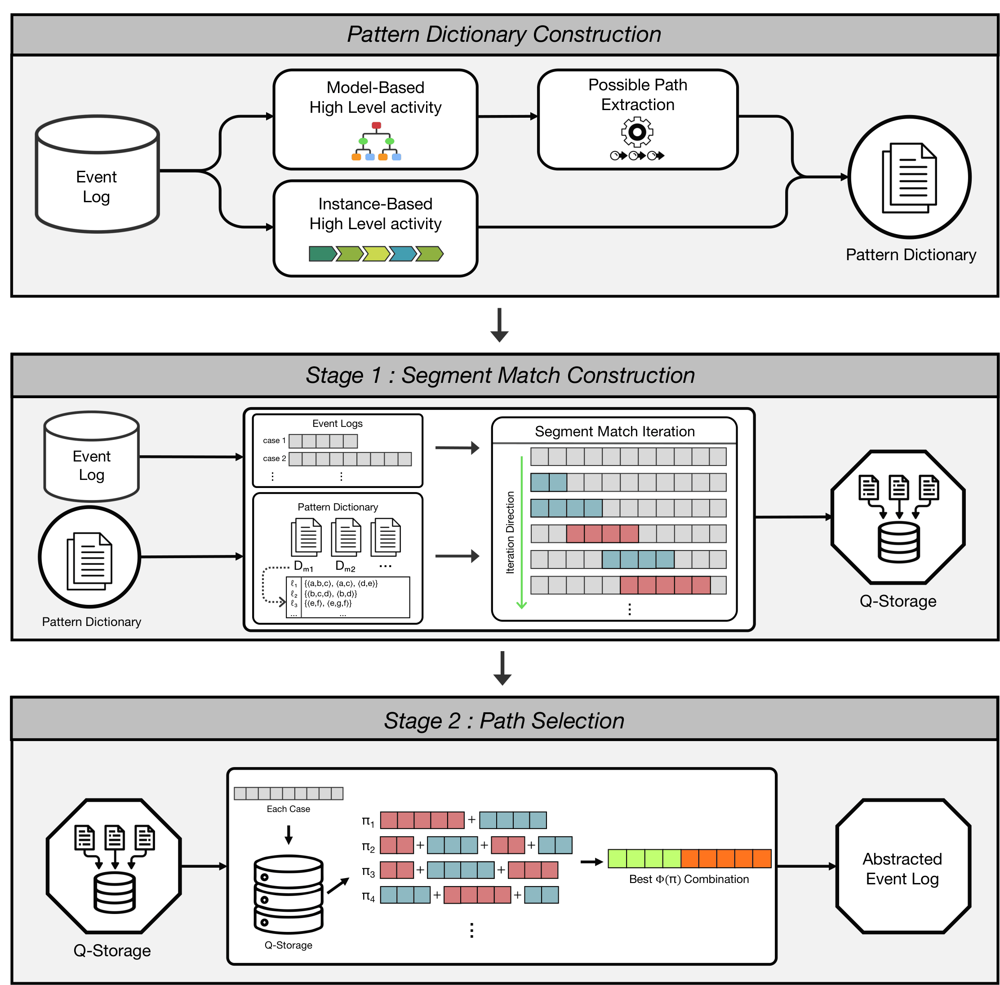

# Event Abstraction Ensembles



This repository contains the implementation of the event abstraction ensemble framework for process mining experiments.

The pipeline builds abstraction dictionaries from model-based and instance-based sources, performs segment matching and path selection, discovers process models, evaluates conformance, and computes complexity metrics.

## Project Structure

```text
event-abstraction-ensembles/
├── configs/
│   └── ...                       # Experiment settings
│   
│
├── data/
│   └── ...                       # Local datasets and intermediate data
│
├── results/
│   └── ...                       # Local experiment outputs
│
├── scripts/
│   ├── run_pipeline.py
│   ├── 01_prepare_lpm_paths.py
│   ├── 02_build_session_patterns.py
│   ├── 03_run_segment_matching.py
│   ├── 04_select_topk_combinations.py
│   ├── 05_discover_models.py
│   ├── 06_evaluate_models.py
│   └── 07_compute_complexity.py
│
├── subscript/
│   ├── abstraction_comparison.py
│   ├── run_method_comparison.py
│   └── visualization_comparison.py
│
└── src/
    └── eae/
        ├── abstraction/
        ├── config.py
        ├── discovery/
        ├── evaluation/
        ├── information/
        ├── lpm/
        ├── matching/
        ├── paths.py
        ├── preprocessing/
        ├── selection/
        ├── session/
        └── visualization/
```

`configs/` contains dataset-specific experiment settings.

`data/` and `results/` are kept as local directories; only the folder structure is tracked in GitHub.


## Datasets

This project uses the following public event logs:

| Dataset | Source | DOI |
|---|---|---|
| BPI Challenge 2012 | 4TU.ResearchData | https://doi.org/10.4121/uuid:3926db30-f712-4394-aebc-75976070e91f |
| BPI Challenge 2015 Municipality 2 | 4TU.ResearchData | https://doi.org/10.4121/uuid:63a8435a-077d-4ece-97cd-2c76d394d99c |

The raw logs should be placed under the paths specified in each YAML config, for example:

## Data Location

Place raw event logs and LPM files under the paths specified in each YAML config.

Example:

```text
data/bpic2015/raw/[bpic2015 event log]
data/bpi2012/raw/[bpi2012 event log]
```

The exact file paths are controlled by:

```yaml
[in config]

dataset:
  raw_log_path: ...

model_based:
  raw_lpm_dir: ...
```

## LPM Input Preparation

Model-based LPM inputs are prepared with ProM.

First, run the following ProM action:

```text
Search for Local Process Models
```

Using the default setting, this project assumes that the top 100 LPMs are selected.

After the LPMs are discovered, use:

```text
Export results as Local Process Model Ranking
```

Then export the generated `Local Process Model Ranking` data to disk and use it as the model-based LPM input for this project.

Export the resulting files and place them under the `raw_lpm_dir` path specified in the YAML config.

Example for BPI 2012:

```text
data/bpi2012/raw/LPM_PN_Set/
```

In the Colab project directory, this corresponds to:

```text
/content/drive/MyDrive/SJ_Lab/github_repo_ver/project_root/data/<bpi2012 or bpic2015>/raw/LPM_PN_Set/
```

The corresponding config entry is:

```yaml
model_based:
  raw_lpm_dir: data/bpi2012/raw/LPM_PN_Set
```

## Main Pipeline

The full experiment pipeline is controlled by `scripts/run_pipeline.py`.

### Run the Full Pipeline

```bash
PYTHONPATH=src python scripts/run_pipeline.py \
  --config configs/<Experiment_Config>.yaml
```

Example:

```bash
PYTHONPATH=src python scripts/run_pipeline.py \
  --config configs/bpic2015.yaml
```

### Run Selected Stages(Steps)

```bash
PYTHONPATH=src python scripts/run_pipeline.py \
  --config configs/<Experiment_Config>.yaml \
  --from-stage <from_stage_example> \
  --to-stage <to_stage_example>
```

Example:

```bash
PYTHONPATH=src python scripts/run_pipeline.py \
  --config configs/bpic2015.yaml \
  --from-stage 05 \
  --to-stage 07
```

## Pipeline Stages(Steps)

| Stage | Script | Description |
|------:|--------|-------------|
| 01 | `01_prepare_lpm_paths.py` | Convert LPMs and enumerate executable paths |
| 02 | `02_build_session_patterns.py` | Build session-based abstraction patterns |
| 03 | `03_run_segment_matching.py` | Construct segment matches between cases and patterns |
| 04 | `04_select_topk_combinations.py` | Select top-k abstraction combinations using dynamic programming |
| 05 | `05_discover_models.py` | Discover process models from original and abstracted logs |
| 06 | `06_evaluate_models.py` | Evaluate conformance metrics |
| 07 | `07_compute_complexity.py` | Compute model complexity metrics |


Stage-specific arguments such as `rank`, `abstract-noise`, `org-noise`, and `install-understandbpmn` are defined inside the YAML config under:


## Main Outputs

Experiment outputs are saved under:

```text
results/runs/{dataset}/{dictionary_variant}/method-{method}/match-{direction}/jump{jump}/K{K}/
```

This is the primary result directory used for analysis and paper results.
Main output folders:

```text
pattern_pool/     # Unified abstraction dictionary
matching/         # Segment matching outputs
selection/        # Selected abstraction combinations
discovery/        # Discovered process models
evaluation/       # Conformance evaluation results
figures/          # Generated figures
```

Additional pipeline execution logs are saved separately under:

```text
results/pipeline_runs/
```

## Additional Analysis Scripts

The `subscript/` directory contains scripts used to generate additional tables and figures for the paper.

### EDA

```bash
PYTHONPATH=src python subscript/abstraction_comparison.py \
  --config configs/<Experiment_Config>.yaml \
  --k <k_example> \
  --jump <jump_example> \
  --rank <rank_example>
```

Example:

```bash
PYTHONPATH=src python subscript/abstraction_comparison.py \
  --config configs/bpic2015.yaml \
  --k 60 \
  --jump 4 \
  --rank 1
```

This script generates the descriptive analysis outputs used for:

```text
Table 1
Figure 2
Figure 3
Table 2
```

The outputs include case-length distribution, inter-event-time distribution, log summary, and BPMN size summary.

### Jump Sweep and Method Comparison

```bash
PYTHONPATH=src python subscript/run_method_comparison.py \
  --ensemble-config configs/<Ensemble_Sweep_Jump_Config>.yaml \
  --session-config configs/<Session_Sweep_Jump_Config>.yaml \
  --lpm-config configs/<LPM_Config>.yaml \
  --rank <rank_example> \
  --ensemble-compare-jump <ensemble_jump_example> \
  --session-compare-jump <session_jump_example> \
  --lpm-compare-jump <lpm_jump_example>
```

Example:

```bash
PYTHONPATH=src python subscript/run_method_comparison.py \
  --ensemble-config configs/bpic2015_ensemble_sweep.yaml \
  --session-config configs/bpic2015_session_sweep.yaml \
  --lpm-config configs/bpic2015_lpm.yaml \
  --rank 1 \
  --ensemble-compare-jump 4 \
  --session-compare-jump 4 \
  --lpm-compare-jump 4
```

This script generates the paper-level jump sweep and method comparison outputs used for:

```text
Figure 4
Figure 5
Figure 6
```

The outputs include the fixed-K jump allowance sweep figure, per-case alignment cost distribution table and figure, and case-length-stratified alignment cost table and figure.

The sweep figure uses all jump values listed in the Ensemble and Session configs.  
The detailed method comparison uses the selected jump values provided by the `--*-compare-jump` arguments.

### BPMN Visualization

```bash
PYTHONPATH=src python subscript/visualization_comparison.py \
  --config configs/<Ensemble_Config>.yaml \
  --k <k_example> \
  --jump <jump_example> \
  --rank <rank_example>
```

Example:

```bash
PYTHONPATH=src python subscript/visualization_comparison.py \
  --config configs/bpic2015.yaml \
  --k 60 \
  --jump 4 \
  --rank 1
```

This script generates the BPMN visualization outputs used for:

```text
Figure 7
Figure 8
Figure 9
```

The outputs include the original BPMN model image, abstracted BPMN model image, abstraction-label overlay, and pattern-region overlays.
## Notes

Large datasets, intermediate files, and experiment results are not tracked by Git.

Only source code, configs, and directory placeholders are included in the repository.
